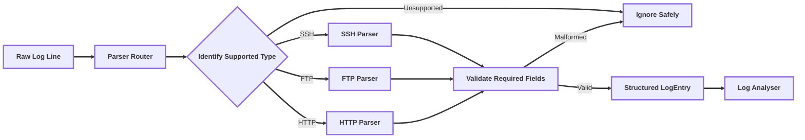
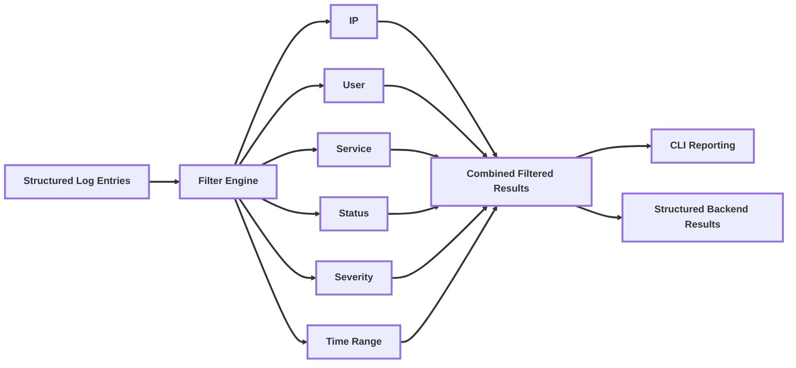
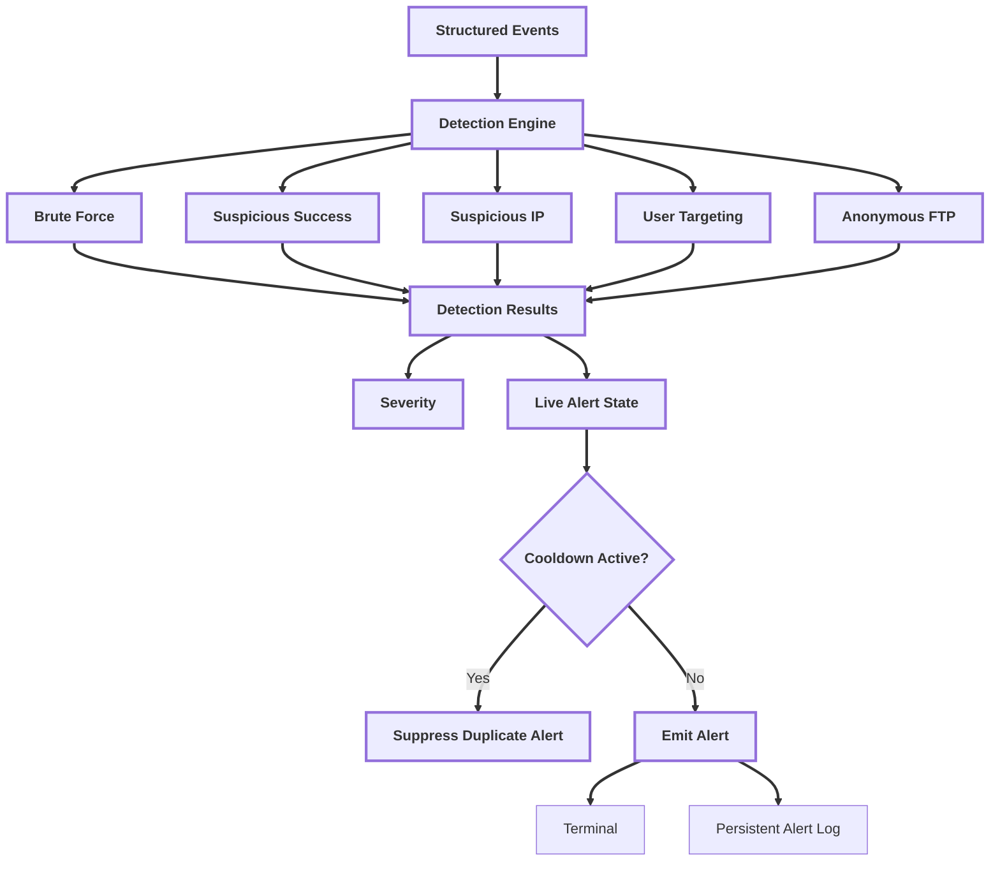
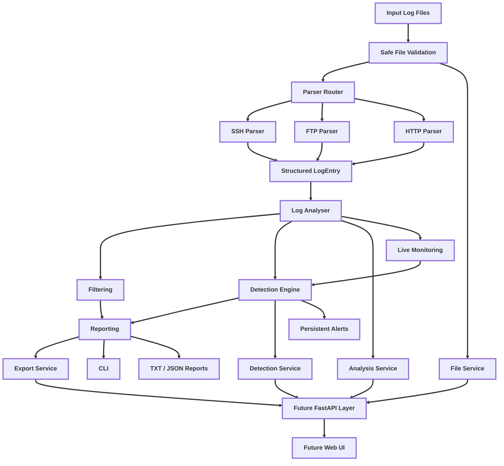

# SentinelIR

SentinelIR is a Python-based incident response and SOC investigation toolkit for analysing authentication-focused log data, identifying suspicious behaviour, monitoring live log activity, and producing structured investigation results.

The project is being developed as a final-year cybersecurity dissertation and is currently centred on a stable CLI backend, reusable service interfaces, and preparation for a FastAPI/Web UI layer.

# Overview

SentinelIR focuses on helping a security analyst investigate authentication-based activity such as:

- Brute-force login attempts
- Suspicious IP activity
- Successful logins after failed attempts
- Distributed user-targeting attacks
- Password spraying-style behaviour
- Live log changes during monitoring
- Generated attack scenarios for testing detections

The long-term direction is to expand SentinelIR into a broader investigation platform that can support log analysis, file triage, hash/signature scanning, IOC enrichment, and a future web UI / SOC-style dashboard.

# Project Goals

SentinelIR aims to provide a lightweight, explainable security-analysis workflow that can:

- Parse supported security log formats into a common structured representation
- Filter events for investigation
- Detect suspicious authentication behaviour
- Monitor live log files
- Persist security alerts
- Generate repeatable test scenarios
- Export investigation results
- Expose the same backend through CLI, API, and future Web UI interfaces

# Supported Log Sources

## SSH

SentinelIR supports SSH authentication activity including failed and successful login events.

Typical fields include:

- Timestamps
- Source IP addresses
- Username
- Authentication status
- Service
- Severity

## FTP

FTP login events are normalised into the same structured event model, and include support for anonymous-login detection.

## HTTP

HTTP parser support extracts login-oriented request information where available, including:

- Timestamps
- Source IP
- Username
- Authentication results
- HTTP method
- Request path
- Status code
- Service

Unsupported or malformed lines are ignored safely rather than being forced into an invalid event.

# Parser Design

SentinelIR separates parser identification, routing, validation, and structured event creation.



## Identification

The parser router checks whether a raw line matches a supported source.

## Routing

Supported lines are routed to the dedicated SSH, FTP, or HTTP parser.

## Validation

Each parser validates the fields required to build a usable event. Missing required values result in the line being rejected safely.

## Structured Event Creation

Valid lines are converted into `LogEntry` objects so filtering, detection, reporting, and live monitoring work against a common model rather than raw text.

# Filtering Design

Filtering operates on structured log events rather than terminal output.

Supported filters include:

- Source IP
- Username
- Service
- Authentication Status
- Severity
- Time range

Filters can be combined so an investigator can narrow a dataset using more than one criterion at the same time.



# Detection Design

SentinelIR uses rule-based detections to identify suspicious authentication behaviour.

Current detection categories include:

- Brute force
- Suspicious successful login following suspicious failures
- Suspicious IP activity
- User targeting
- Anonymous FTP access

Detection logic is service-aware so events from different services are not treated as one undifferentiated stream.



## Cooldown behaviour

Live detections keep alert state so repeated events do not continuously produce duplicate alerts within the configured cooldown period.

## Persistent Alerts

Live alerts can be written to the shared application alert-log path, allowing detection history to survive beyond terminal output.

# Structured Results

The backend exposes reusable data structures that do not depend on CLI printing.

## Analysis Summary

The structured analysis summary contains:

- Total events
- Failed logins
- Successful logins
- Unique IP addresses
- Per-service totals
- Severity totals
- Detection counts

## Detection Results

The structured detection result groups:

- Brute-force findings
- Suspicious-success findings
- Suspicious-IP findings
- User-targeting findings
- Anonymous FTP findings

These models are intended for reuse by the CLI, service layer, and future API.

# Service Layer

A small service layer sits between user-facing interfaces and the existing backend.

Current service responsibilities are intentionally narrow:

| Service | Responsibility |
|---|---|
| `AnalysisService` | Coordinates analysis and structured analysis results |
| `DetectionService` | Coordinates reusable detection results |
| `FileService` | Coordinates safe input-file validation |
| `ExportService` | Coordinates safe report-export handling |

The services do not replace the existing parser, analyser, detection, or reporting code. They provide a stable interface that the CLI and future FastAPI routes can share.

# Architecture



# Safe Paths and File Validation

SentinelIR centralises project paths using `pathlib.Path`.

Shared paths cover:

- Project root
- Configuration
- Input logs
- Application logs
- Alert logs
- Reports

Input-file validation checks:

- File existence
- Regular-file status
- Supported extensions
- Readability
- Approved input directory
- Attempts to escape the configured log directory

Export validation checks report filenames and prevents output from being written outside the approved reports directory.

# CLI

The project exposes four root launch commands:

Command | Purpose |
|---|---|
| `./analyse` | Static log analysis and investigation |
| `./monitor` | Live file monitoring and alerting |
| `./generate` | Controlled scenario generation |
| `./web` | Web entry-point scaffold / future API launcher |

## Static Analysis

`./analyse` provides the main investigation workflow.

The CLI can:

- Load supported log files
- Analyse authentication events
- View summaries and statistics
- Filter events
- Review detections
- Export results

## Live Monitoring

`./monitor` watches configured log files for new events and runs live detection logic against appended data.

## Scenario Generation

`./generate` creates controlled log activity for development, testing, and demonstration.

Supported scenario groups:
- SSH
- FTP
- HTTP
- Mixed multi-service

Scenario types include:
- Failed login
- Successful login
- Brute force
- Suspicious success
- User targeting
- Normal activity
- Mixed attack
- Anonymous FTP login where applicable

Generation can write a complete file or stream events with configured delay and append/overwrite behaviour.

## Reporting

SentinelIR provides both human-readable CLI reporting and reusable structured results.

Current reporting capabilities include:

- Investigation summaries
- Attack summaries
- Attack statistics
- Filtered results
- Detection findings
- TXT export
- JSON export

# Installation

SentinelIR provides a one-command project installer.

```bash
chmod +x install.sh analyse monitor generate web
./install.sh
```

The installer creates a project virtual environment and installs the required Python dependencies.

The project launcher scripts use the project `.venv` environment.

Manual activation is also possible:

```bash
source .venv/bin/activate
```

# Configuration

Runtime configuration is stored in:

```text
sentinel_config.json
```

Configuration is used for values such as:

- Watched files
- Monitoring behaviour
- Alert thresholds
- Cooldown behaviour
- Detection settings

Configuration loading is centralised so interfaces do not need to duplicate path handling.

# Testing and Code Quality

SentinelIR uses:

- `pytest` for automated testing
- Flake8 for style and static checks
- Pre-commit hooks
- Python compile validation
- GitHub Actions CI
- Protected `main` branch workflows

Run the local quality checks with:

```bash
python -m compileall app tests
flake8 app tests
pytest
```

The GitHub Actions workflow runs quality checks on pushed branches and pull requests so changes can be validated before merging into `main`.

# Project Structure

```text
SentinelIR/
├── .github/
│   └── workflows/
│       └── ci.yml
├── app/
│   ├── cli/
│   ├── config/
│   ├── detection/
│   ├── generator/
│   ├── interaction/
│   ├── log_analyser/
│   ├── models/
│   ├── monitoring/
│   ├── parsers/
│   ├── reporting/
│   ├── runtime/
│   ├── services/
│   └── utils/
├── dissertation/
├── docs/
├── log_files/
├── tests/
├── .flake8
├── .gitignore
├── .pre-commit-config.yaml
├── analyse
├── generate
├── install.sh
├── monitor
├── pyproject.toml
├── pytest.ini
├── requirements.txt
├── sentinel_config.json
├── web
└── README.md
```

Generated runtime output such as application logs, reports, Python caches, virtual environments, and pytest caches is excluded from version control.

# Development Workflow

SentinelIR uses a branch-and-pull-request workflow.

Typical development flow:

```text
Issue
  ↓
Feature / fix branch
  ↓
Implementation
  ↓
Local compile + Flake8 + pytest
  ↓
Push
  ↓
GitHub Actions
  ↓
Pull request
  ↓
Protected main branch
```

This supports traceability between project issues, code changes, tests, and dissertation evidence.

# Research And Dissertation Direction

SentinelIR is also being used as the implementation artefact for a cybersecurity dissertation.

The project is being developed incrementally so software-engineering evidence can be collected alongside the implementation rather than reconstructed at the end.

The methodology will document:

- Architecture
- Implementation approach
- Testing strategy
- Traceability
- Experimental design
- Evaluation

## Evaluation Design

Evaluation is planned around both synthetic and controlled experimental data.

## Synthetic Datasets

The built-in scenario generator provides repeatable attack and normal-activity datasets.

## Controlled CTF Dataset

A controlled CTF environment is planned as a source of primary experimental data.

The intended process is:

1. Build a deliberately vulnerable test environment
2. Perform known attacks in a controlled setting
3. Capture the generated service logs
4. Analyse those logs using SentinelIR
5. Compare SentinelIR detections against the known ground truth

Likely early targets align with the services SentinelIR already supports:

- SSH
- HTTP
- FTP

This can support evaluation of:

- True positives
- False positives
- False negatives
- Detection rate
- Detection latency
- Parser success
- Malformed-input handling
- Performance

# Roadmap

## Completed / Stable Foundation

- SSH, FTP, and HTTP parsing
- Structured event model
- Combined filtering
- Rule-based detections
- Live monitoring
- Alert cooldown
- Persistent alerts
- Scenario generation
- TXT and JSON reporting
- Shared project paths
- Safe file validation
- Structured analysis and detection results
- Small backend service layer
- Flake8 / pytest / compile checks
- GitHub Actions CI
- Branch protection and pull-request workflow

## Next

- FastAPI application foundation
- Health/version endpoints
- API schemas
- Analysis endpoints
- Filtering and detection endpoints
- Export endpoints
- API error handling and security boundaries

## After API

- Web dashboard
- File upload/selection workflow
- Summary views
- Event tables
- Filtering controls
- Detection views
- Exports
- Live-monitoring integration

## Future / Optional

- Additional log sources
- Broader detection coverage
- Expanded CTF evaluation
- Desktop GUI development if it remains useful
- Additional CLI convenience features

# Limitations

Current limitations include:

- Only SSH, FTP, and HTTP are supported as implemented parser sources
- Detections are rule-based rather than machine-learning-based
- The FastAPI layer is not yet the primary interface
- The Web UI is not yet implemented
- The desktop GUI is not the primary supported interface
- Current evaluation is still being developed

# Design Principles

SentinelIR currently prioritises:

- Explainable detections
- Modular parsers
- Reusable backend logic
- Safe file handling
- Testability
- Small focused services
- Minimal duplication between interfaces
- Incremental development
- Traceable engineering decisions

SentinelIR is under active development as both a cybersecurity investigation toolkit and a final-year dissertation implementation artefact.
