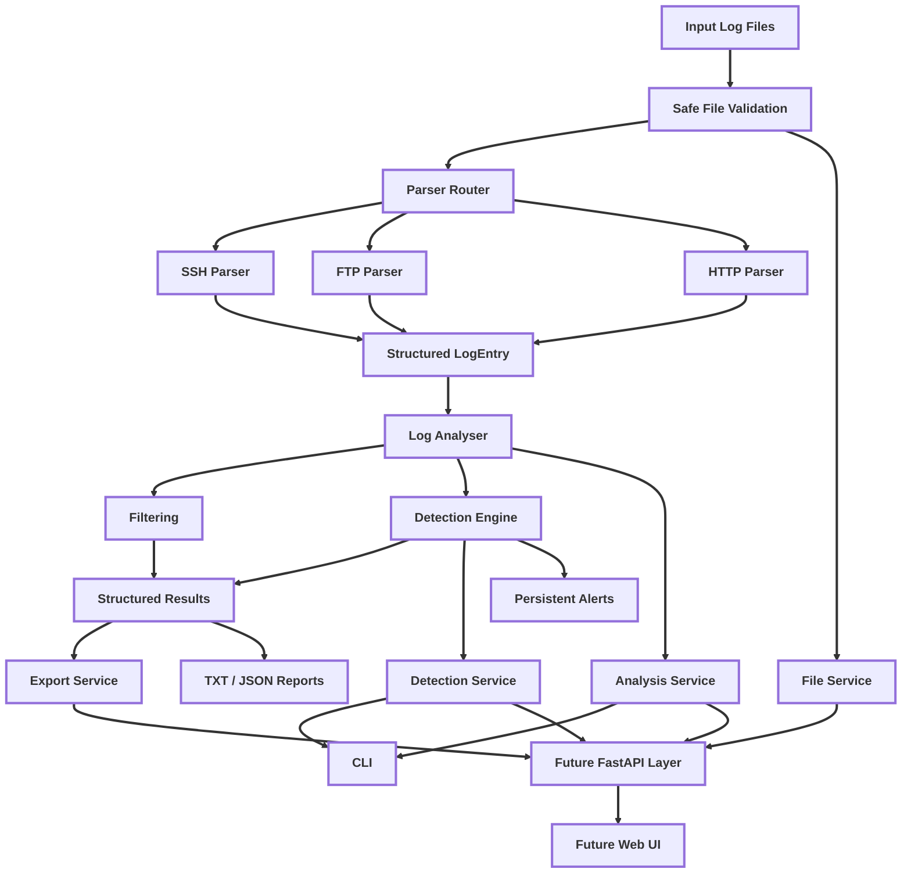

# 3.0 Methodology

This chapter outlines the methodology used to design, implement, test, and evaluate SentinelIR. The project follows an incremental software engineering approach, with development divided into clearly defined functional and technical tasks that can be implemented, validated, and reviewed independently.

The methodology covers the development process, requirements traceability, system architecture, implementation decisions, testing strategy, experimental data collection, and evaluation approach. Particular emphasis is placed on maintaining a stable reusable backend while progressively extending the system towards API and Web UI support.

The chapter also explains how synthetic data and controlled CTF-generated logs will be used to evaluate SentinelIR against known ground truth. This allows the effectiveness of the system to be assessed using repeatable attack scenarios, measurable detection outcomes, and controlled experimental conditions.

The methodology is structured as follows:

- **Section 3.1**: Describes the development approach used throughout the project
- **Section 3.2**: Explains requirements management and traceability
- **Section 3.3**: Presents the overall system architecture
- **Section 3.4**: Describes the implementation methodology and major technical components
- **Section 3.5**: Outlines the testing strategy
- **Section 3.6**: Explains the experimental data collection process
- **Section 3.7**: Defines the evaluation methodology and metrics
- **Section 3.8**: Discusses ethical and security considerations
- **Section 3.9**: Identifies limitations of the methodology

## 3.1 Development Approach

SentinelIR was developed using an incremental and issue-driven software engineering approach. Rather than implementing the complete system in a single development cycle, the project was divided into smaller functional areas that could be designed, implemented, tested, and reviewed independently. This approach was selected to reduce the risk of introducing large regressions into the existing CLI backend while allowing the project to expand progressively towards API and Web UI support.

Development work was organised through GitHub Issues, with each issue representing a defined area of functionality or engineering improvement. Examples include repository validation, automated code-quality protection, centralised path handling, reusable backend interfaces, and technical documentation. Each issue further divided into smaller tasks so that progress could be tracked and individual changes could be completed in a controlled manner.

A branch-based workflow was used for implementation. New development was completed on dedicated branches rather than directly on the protected `main` branch. Once a task or issue was completed, the branch was validatedd locally before being pushed to the remote repository and submitted through a pull request. This provided a clear separation between stable code and work in progress, while also creating a traceable history of the decisions and changes made throughout development.

Automated quality checks were integrated into this workflow using GitHub Actions. Pull requests are validated using Python compilation checks, Flake8, and the pytest tests suite before they are merged into `main`. Branch protection rules are used to prevent unvalidated changes from being merged directly. This supports continuous regression testing and helps ensure that new development does not unintentionally break previously working functionality.

The project also follows an architecture-preserving approach. Existing CLI functionality is treated as the stable backend foundation, with new components added around it rather than replacing working behaviour unncessarily. For example, structured result models and a small service layer were introduced to make existing analysis, detection, file handling, and export functionality reusable by future interfaces. This allows the CLI, future FastAPI layer, and planned Web UI to share the same core backend logic.

This development approach also support dissertation traceability. Requirements and engineering tasks can be linked to implementation branches, tests, pull requests, and later evaluation evidence. As a result, the methodology reflects not only what was implemented, but also the process used to design, validate, and evolve SentinelIR throughout the project.

## 3.2 Requirements And Traceability

SentinelIR uses a traceable development process in which requirements are linked to implementation tasks, source-coded changes, testing, and evaluation evidence. This approach was chosen so that the development of the system could be demonstrated systemically rather than described at the end of the project.

High-level project requirements are broken down into smaller technical tasks and recorded on GitHub Issues. Each issue defines a specific development objective, such as adding support for a new parser, improvign detection logic, introducing reusable backend interfaces, or strengthening testing and repository quality. Development is then completed on a dedicated branch associated with that area of work.

This creates a development chain in which a requirement can be followed through the project lifecycle:

```text
Requirement
→ GitHub Issue
→ Development Branch
→ Implementation
→ Automated / Manual Testing
→ Pull Request
→ Evaluation Evidence
```

The approach is influenced by the principles of the V-Model, particularly the relationship between implementation stages and corresponding validation tasks. Functional requirements are therefore considered alongside the method that will later bse used to verify them. For example, a requirement to detect brute-force authentication activity is linked to the implementation of detection logic, automated detection tests, generated attack scenarios, and later experimental evaluation using known attack data.

Traceability is also maintained through version control. Feature branches and pull requests provide a record of when functionality was introduced, while GitHub Actions provides evidence that compilation, static code-quality checks, and automated tests were successfully completed before changes were merged into the protected `main` branch.

This approach is intended to support both software quality and dissertation evidence. By maintaining links between requirements, implementation, tests, and experimental results, it becomes possible to demonstrate not only that a feature exists, but also how it was validated and whether it satisfies the original requirement.

| **Requirement** | **Implementation** | **Verification** | **Evaluation**
|---|---|---|---|
| Parse SSH authentication logs | SSH parser | Parser unit tests | CTF SSH logs |
| Detect brute-force logic | Detection engine | Detection tests | Synthetic + CTF logs |
| Filter investigation events | Filtering logic | Filter tests | Analyst investigation workflow |
| Export investigation results | Reporting/export layer | Export tests | Manual validation |
| Monitor live log activity | Live monitoring runtime | Runtime tests | Detection latency experiment |

## 3.3 System Architecture

SentinelIR was designed using a modular architecture that separates log ingestion, parsing, analysis, detection, reporting, and user-facing interfaces. This separation allows individual components to be developed and tested independently while sharing a common structured representation of log events.

The architecture begins with input log files. Before a file is processed, its path is validated to ensure it exists, uses a supported file type, and remains within the approved project input directory. Valid log lines are then passed to the parser routing layer.

The parser router identifies the type of log entry and forwards it to the relevant service-specific parser. SentinelIR currently supports SSH, FTP, and HTTP authentication-related log sources. Each parser is responsible for extracting the fields required for analysis and converting the raw line into a common structured `LogEntry` object.

Using a shared event model means that later components do not need to understand the original log format. Filtering, detection, reporting, and live monitoring can instead operate against the same structured fields, such as timestamps, source IP addresses, username, service, authentication status, and severity.

The `LogAnalyser` acts a primary analysis component. Parsed events are stored and processed so that investigation summaries, filtering operations, and detection logic can be applied. Filtering allows events to be narrowed by multiple criteria, while the detection engine applies rule-based detection techniques to identify suspicious behaviour such as brute-force activity, suspicious successful logins, suspicious IP activity, user-targeting behaviour, and anonymous FTP access.

A small service layer sits above the core backend components. The service layer provides reusable interfaces for analysis, detection results, file validation, and report exports. This avoids coupling future interfaces directly to CLI-specific behaviour and supports reuse by the planned FastAPI application and Web UI.

Reporting is separated from the underlying detection logic. SentinelIR can expose structured analysis and detection results while also producing human-readable CLI output and TXT/JSON report exports. Live monitoring reuses the same parsing and detection components so taht newly appended log events can be processed without introducing a separate analysis architecture.

The resulting architecture can therefore be viewed as a layered flow:



This design was selected to improve maintainability, testability, and extensibility. New log sources can be introduced through additional parsers, while future interfaces can reuse the existing backend without duplicating the core analysis and detection logic.

## 3.4 Implementation Method


### 3.4.1 Log Parsing


### 3.4.2 Structured Event Modelling


### 3.4.3 Filtering


### 3.4.4 Detection Logic


### 3.4.5 Live Monitoring


### 3.4.6 Alert Cooldown And Persistence


### 3.4.7 Scenario Generation


### 3.4.8 Service Layer


### 3.4.9 Safe File Handling


### 3.4.10 API And Web Integration


## 3.5 Testing Strategy


## 3.6 Experimental Data Collection


### 3.6.1 Synthetic Dataset


### 3.6.2 Controlled CTF Dataset


## 3.7 Evaluation Method


## 3.8 Ethical And Security Considerations


## 3.9 Methodology Limitations
